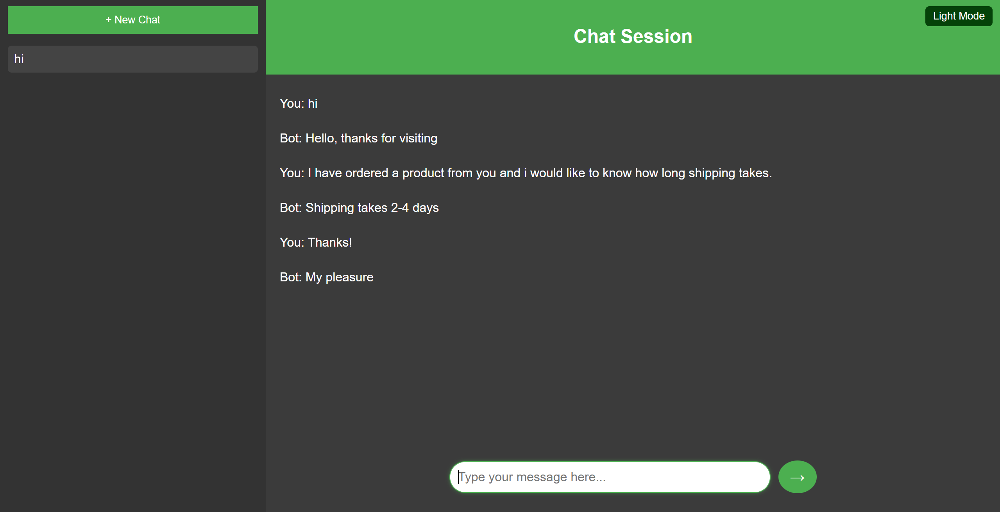
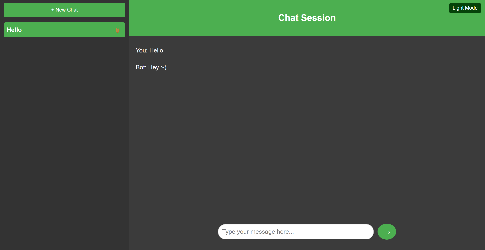

# Chatbot cu o FNN cu 2 straturi

Proiectul de fata are ca scop implementarea unui chatbot pentru un site al unui magazin ce se ocupa cu comertul de ceai si cafea. Chatbot-ul poate raspunde la intrebari legate de activitatea comerciala a magazinului (vanzari, livrari, produse etc.), fara a putea fi capabil sa dea raspunsuri generale legate de alte subiecte. Astfel, pentru intrebari care nu au legatura cu subiectul site-ului, raspunsul oferit va fi "I do not understand. Please rephrase!".

Constructia chatbot-ului utilizeaza PyTorch si o FNN cu 2 straturi ascunse, iar raspunsurile date se bazeaza pe contextele definite in intents.json. Pentru customizarea raspunsurilor si a scopului chatbot-ului, se poate modifica fisierul respectiv( fiecare modificare a fisierului intents.json cere apoi reluarea antrenamentului -- rulati train.py).

## Link github
https://github.com/andarobea/Chatbot

## Instalare

Pentru a folosi chatbot-ul este necesara crearea unui environment si instalarea unor biblioteci si dependinte. In acest scop am creat doua script-uri bash, install.sh si run.sh. Rulati:

    chmod +x install.sh run.sh
    source install.sh

Daca in urma rularii script-ului nu se instaleaza bine toate dependintele necesare va trebui sa rulati

    (venv) $ pip install Flask torch torchvision nltk numpy
    (venv) $ python
    >>> import nltk
    >>> nltk.download('punkt')
    >>> nltk.download('punkt_tab')

Pentru a porni antrenamentul si a porni server-ul dedicat, rulati:

    ./run.sh

Pentru a folosi interfata dedicata accesati:

    http://127.0.0.1:5000

In final rulati ctrl + z / ctrl + c din terminal pentru a inchide sesiunea si:

    fuser -n tcp -k 5000

pentru a va asigura ca portul a fost inchis corect.

Pentru dezactivarea venv folositi:

    $ deactivate

## Constructia si antrenarea chatbot-ului
1. [Fisiere necesare pentru chatbot](#chatbot)
2. [Chatbot folosind biblioteca chatterbot](#chatterbot)
3. [Chatbot folosind o cheie API catre OPENAI](#openai)
4. [Interactiunea cu interfata](#flask)

## Interfata chatbot
1. [Partea de html](#html)
2. [Partea de css](#css)
3. [Partea de javascript](#javascript)
4. [Exemplu utilizare interfata](#exemplu-utilizare-interfata)

### Chatbot

Pentru implementarea efectiva am avut nevoie de cateva fisiere:

1. nltk_utils.py: functii utilitare pentru sarcini de baza de Procesare a Limbajului Natural (NLP), precum tokenizare, stemming si crearea unei reprezentari tip "bag-of-words". Functiile sunt implementate in Python folosind bibliotecile nltk si numpy.

2. model.py: Feedforward neural network cu 2 straturi ascunse implementata cu Pytorch. Contine o clasa NeuralNet care mosteneste torch.nn.Module (clasa de baza pentru toate retelele neuronale in Python). Foloseste functia de activare relu.

3. train.py: antreneaza modelul pe baza fisierului intents.json, ce contine pattern-uri, raspunsuri din care chatbot-ul poate alege randomizat (dupa caz) si tag-uri. Sunt folosite functiile definite pentru a tokeniza pattern-urile si a aplica stemming-ul, apoi alcatuind un vector care contine toate cuvintele individuale unicce (stemmed).
    Hyperparametri:

    num_epochs: numarul de iteratii al antrenamentului (1000).
    batch_size: marimea mini-batchurilor pentru antrenament (8).
    learning_rate: rata pentru optimizer.
    input_size: lungimea vectorului bag-of-words (inputul).
    hidden_size: numar de neuroni in stratul ascuns.
    output_size: numar de clase (tags).

    Rezulta in fisierul data.pth folosit pentru predictii.
    Initializeaza modelul si foloseste GPU daca este disponibil.

4. chat.py: importa toate bibliotecile necesare si initializeaza toti parametri, tokenizeaza inputul si il converteste intr-o reprezentare de tip bag-of-words pe baza careia prezice tag-ul cu cea mai mare valoare (torch.max). Analizeaza intervalul de incredere prin convertirea output-ului modelului in probabilitatai si verifica daca probabilitatea prezisa depaseste 75%. Daca treshold-ul de incredere este depasit, alege un raspuns random din cele disponibile, altfel returneaza "I do not understand. Please rephrase!".

### Chatterbot
    chatterbot.py este un model de chatbot care utilizeaza o biblioteca existenta folosita in construirea si antrenarea de chatbots. Una din incercarile nereusite de constructie.

### OPENAI
    openai.py construieste chatbot-ul legandu-l printr-o cheie API la un model cunoscut de chatbot, in acest caz gpt-3.5-turbo. Un astfel de chatbot ar raspunde la o selectie mult mai mare de intrebari, utilizand direct Chat GPT, dar nu ar mai fi limitat contextual la scopul site-ului: cafea si ceaiuri. Modelul nu poate fi folosit momentan din cauza cheii API, care trebuie platita, dar o alternativa ar fi instalarea si folosirea unui alt LLM precum LLama.

### Flask

Fisierul app.py este serverul principal al aplicatiei chatbot, construit cu Flask. Acesta defineste doua rute: una de tip GET pentru a servi pagina principala (index.html), unde utilizatorii pot interactiona cu chatbotul, si una de tip POST pentru a primi mesaje de la utilizatori si a returna raspunsurile chatbotului sub forma de JSON. La primirea unui mesaj, serverul apeleaza functia get_response din fisierul chat.py, care proceseaza mesajul folosind un model antrenat cu PyTorch si genereaza un raspuns bazat pe intentiile definite in intents.json. Serverul ruleaza local si poate fi accesat in browser sau prin cereri API.

### HTML
Fisierul html index.html din folderul template defineste structura de baza a interfetei chatbot-ului. 
Acesta include: 
1. Ecran de welcome
- "Prima" pagina a site-ului
- Contine un mesaj de intampinare si un buton pentru a incepe o sesiune noua de chat
- Ne permite sa alternam intre light mode si dark mode printr-un buton din coltul din dreapta-sus al paginii.
2. Interfata de chat
- Se afla pe "a doua pagina" a site-ului
- Afiseaza conversatia curenta si permite utilizatorului sa comunice cu chatbot-ul
- Ne permite sa alternam intre light mode si dark mode printr-un buton din coltul din dreapta-sus al paginii.
3. Sidebar-ul
- Se afla pe "a doua pagina" a site-ului
- Ne permite sa gestionam sesiuni multiple de chat.

### CSS
Fisierul css style.css din folderul static este responsabil pentru stilizarea interfetei utilizatorului.
Structura generala:
1. Stilizarea globala:
- Resetarea marginilor si definirea fontului de baza.
- Alinierea continutului in centrul paginii.
2. Container principal:
- Layout flexibil pentru organizarea elementelor: sidebar, ecran de bun venit si interfata de chat.
3. Sidebar:
- Afisarea listelor de sesiuni cu scrollbar personalizat si buton pentru chat nou.
4. Ecranul de bun venit:
-Design centralizat, cu mesaj de intampinare si buton pentru a incepe o sesiune.
5. Interfata de chat:
- Afisarea mesajelor intr-un container scrollabil si un input pentru mesaje cu efecte hover si focus.
6. Light/Dark Mode:
- Permite comutarea intre doua teme, ajustand fundalul, culorile si elementele interactive.
7. Butoane si interactivitate:
- Stilizare pentru butoanele de trimitere, comutare tema si hover pe sesiunile de chat.
8. Delete button:
- Stilizarea butonului de delete

### JAVASCRIPT
Fisierul JavaScript gestioneaza functionalitatea chatbot-ului, incluzand manipularea interfetei, salvarea conversatiilor si interactiunea cu backend-ul.
Functii principale:
1. saveChatsToLocalStorage()
- Salveaza conversatiile curente in localStorage pentru a persista datele dupa reimprospatarea paginii.
2. loadChatsFromLocalStorage()
- Incarca conversatiile salvate din localStorage si initializeaza aplicatia cu acestea.
3. toggleTheme()
- Schimba tema interfetei intre Light Mode si Dark Mode si actualizeaza starea in localStorage.
4. createNewChat()
- Creeaza o noua sesiune de chat goala, reconstruieste lista de sesiuni si incarca chat-ul nou creat.
5. rebuildChatList()
- Reconstruieste lista sesiunilor de chat pe baza conversatiilor salvate si adauga butoane pentru stergere.
6. loadChat(index)
- Incarca mesajele din sesiunea de chat specificata prin index si marcheaza sesiunea activa.
7. deleteChat(index)
- Sterge sesiunea de chat corespunzatoare index-ului, actualizeaza lista si afiseaza o sesiune noua sau ecranul de bun venit daca toate conversatiile sunt sterse.
8. sendMessage()
- Proceseaza mesajul introdus de utilizator:
    - Afiseaza mesajul in interfata.
    - Trimite mesajul catre backend folosind functia fetchBotResponse().
    - Afiseaza raspunsul chatbot-ului sau un mesaj de eroare daca cererea esueaza.
9. fetchBotResponse(userMessage)
- Trimite mesajul utilizatorului catre serverul Flask printr-o cerere POST si returneaza raspunsul primit de la backend.
10. appendMessage(text, sender)
- Adauga un mesaj nou in interfata de chat, fie de la utilizator, fie de la bot, si asigura derularea la ultimul mesaj.
11. saveMessage(text, sender)
- Salveaza mesajele (text si tipul expeditorului) in sesiunea curenta de chat.
12. setInputPosition()
- Ajusteaza pozitia input-ului de mesaje in functie de continutul actual al chat-ului (centru sau josul paginii).

Fluxul principal de interactiune
- Aplicatia se initializeaza cu date salvate din localStorage folosind loadChatsFromLocalStorage() si gestioneaza tema folosind toggleTheme().
- Utilizatorul poate incepe un chat nou cu createNewChat() si trimite mesaje folosind sendMessage().
- Mesajele sunt salvate local si trimise catre server pentru a primi raspunsuri.
- Utilizatorul poate sterge sesiuni individuale, iar aplicatia isi actualizeaza automat starea si interfata.

Aceasta implementare asigura o experienta interactiva, cu persistenta datelor si integrare backend.

# Exemplu utilizare interfata
Mai jos voi exemplifica functiile interfatei chatbot-ului.

Pagina principala

Light mode

Pagina de chat in stagiul initial

Conversatie

Creare chat-uri multiple

Stergere chat

Stergere chat activ

Stergerea ultimului chat

Light mode

## Contributii Individuale
Adi: interfata chat-ului (index.html, style.css, script.js) + openai.py, app.py 
Anda: backend chatbot (train.py, nltk_utils.py, model.py, intents.json, chatterbot.py, chat.py) + scripturi (install.sh, run.sh)

## Dificultati intampinate
Adi: 
- utilizare javascript

Rezolvare: 
- am urmarit niste tutoriale pentru a intelege conceptele necesare pentru a realiza interfata chatbot-ului

 
Anda: 

- crearea modelului de antrenament
- intelegerea functionalitatii tokenizerii si stemmingului
- modul de functionare al unui FNN

Rezolvare: 
- am cautat tutoriale de implementare de modele cu FNN